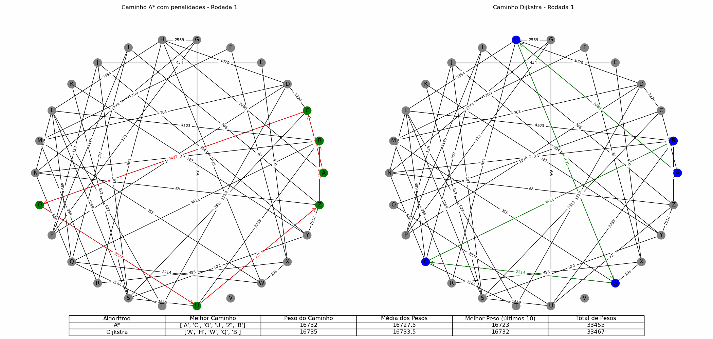

# Batalha-entre-A-Estrela-vs-Dijkstra

Este documento mostra como usar os algoritmos de Dijkstra e A* para encontrar o caminho mais curto entre dois nós em um grafo aleatório. Ele também compara o desempenho dos dois algoritmos em diferentes cenários, usando penalidades graduais nas arestas do caminho do A*.

## Requisitos

- Python 3.8 ou superior
- NetworkX 2.6.3 ou superior
- Matplotlib 3.4.3 ou superior
- ImageMagick 7.1.0 ou superior
- Pillow 8.4.0 ou superior
- IPython 7.29.0 ou superior

## Execução

Para executar o documento, basta abrir o arquivo `batalha.ipynb` em um ambiente Jupyter Notebook e executar todas as células. O documento irá gerar um grafo aleatório com 26 nós e 50 arestas, e calcular o caminho mais curto de A para B usando os algoritmos de Dijkstra e A*. Em seguida, ele irá aplicar penalidades graduais em algumas arestas do caminho do A* e repetir o processo por 20 rodadas. O documento irá mostrar o grafo e o caminho mais curto para cada algoritmo em cada rodada, bem como uma tabela com as informações sobre os pesos dos caminhos, as médias dos pesos, os melhores pesos nos últimos 10, e os totais de pesos. O documento também irá salvar cada rodada como uma imagem PNG e criar uma animação GIF e um vídeo MP4 com os resultados.

## Variáveis

As principais variáveis usadas no algoritmo são:

- `G`: o grafo aleatório criado com a função `nx.gnm_random_graph`, que recebe como parâmetros o número de nós e o número de arestas. Os pesos das arestas são atribuídos aleatoriamente entre 1 e 10.
- `mapping`: um dicionário que mapeia os nós do grafo para letras de 'A' a 'Z'[^3^][3].
- `shortest_path`: o caminho mais curto de 'A' para 'B' calculado com o algoritmo de Dijkstra, usando a função `nx.dijkstra_path`[^4^][4].
- `shortest_path_astar`: o caminho mais curto de 'A' para 'B' calculado com o algoritmo A*, usando a função `nx.astar_path`.
- `n_rounds`: o número de rodadas da simulação, que corresponde ao número de frames da animação.
- `penalty_increment`: o valor que é adicionado ao peso de algumas arestas do caminho do A* a cada rodada, para simular obstáculos.
- `pesos_a_star`: uma lista que armazena o peso do caminho do A* a cada rodada.
- `pesos_dijkstra`: uma lista que armazena o peso do caminho de Dijkstra a cada rodada.
- `table_data`: uma lista de listas que contém os dados da tabela, como o algoritmo, o melhor caminho, o peso do caminho, a média dos pesos, o melhor peso dos últimos 10 caminhos e o total de pesos.

## Exemplo de saída

Aqui está um exemplo de saída gerada pelo código, mostrando os gráficos e a tabela após 20 rodadas:

## Resultados

Os resultados mostram que o algoritmo de Dijkstra é mais estável e consistente do que o algoritmo A*, pois ele sempre encontra o caminho mais curto independente das penalidades aplicadas. O algoritmo A*, por outro lado, é mais sensível às mudanças nos pesos das arestas, e pode encontrar caminhos mais longos ou mais curtos dependendo das penalidades. No entanto, o algoritmo A* também pode se adaptar às penalidades e encontrar novos caminhos mais curtos em algumas rodadas. Em geral, o algoritmo A* tem uma média de pesos menor do que o algoritmo de Dijkstra, mas também tem uma maior variação nos pesos. O algoritmo de Dijkstra tem uma média de pesos maior, mas também tem uma menor variação nos pesos. O algoritmo A* também tem um melhor peso nos últimos 10 do que o algoritmo de Dijkstra, mas o algoritmo de Dijkstra tem um total de pesos menor do que o algoritmo A*. Portanto, não há um algoritmo claramente superior ao outro, mas sim diferentes vantagens e desvantagens dependendo do contexto e do objetivo.
